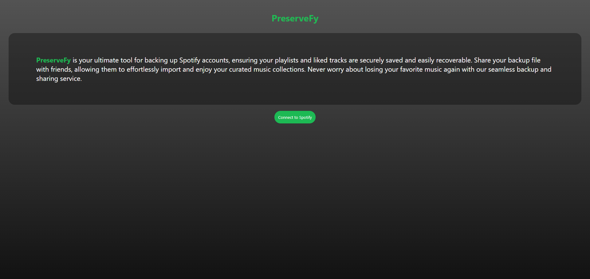
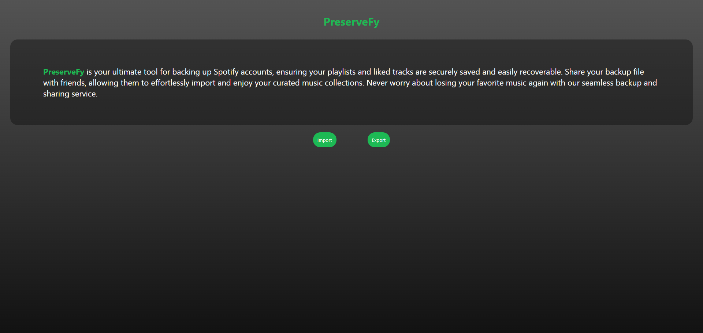
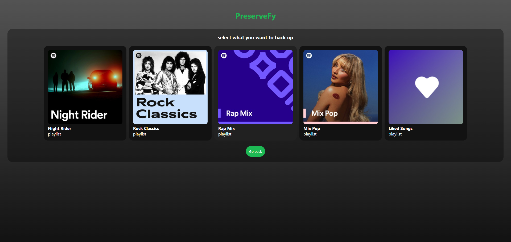
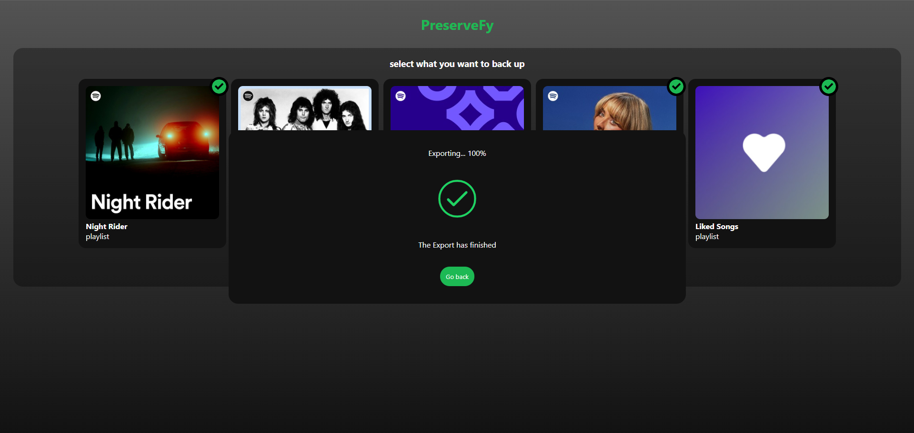
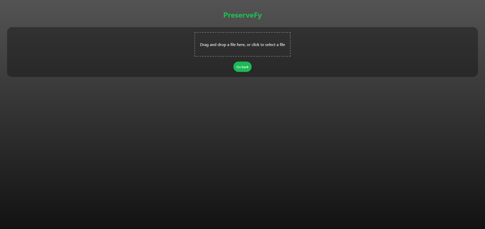
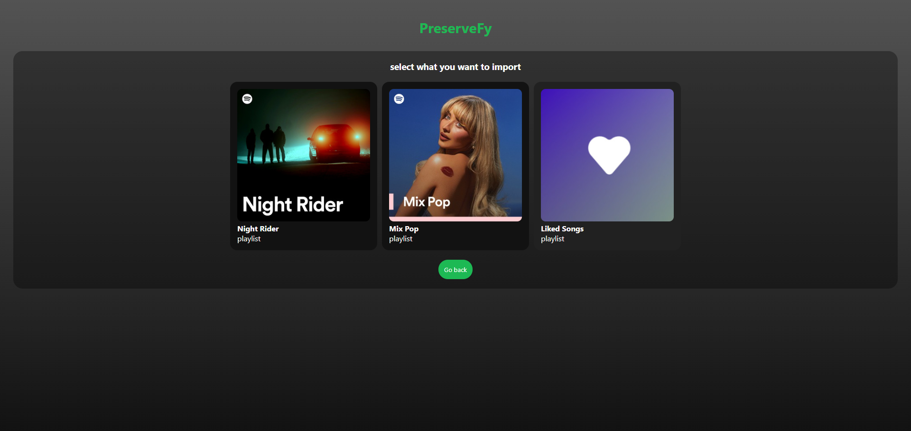
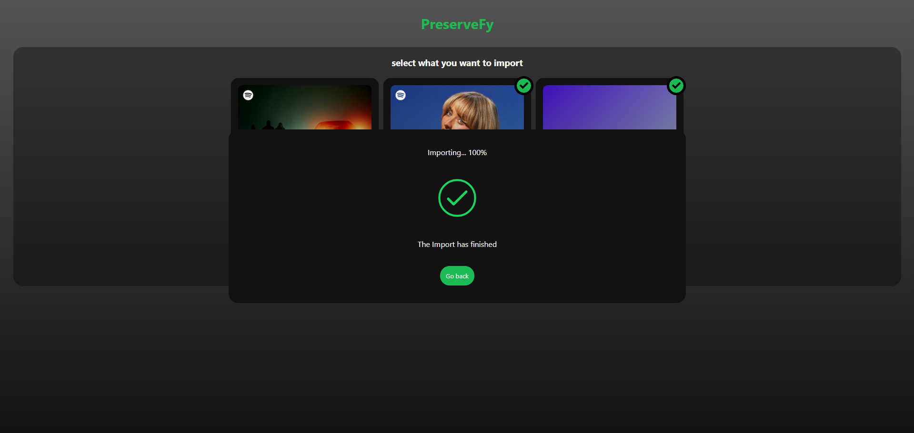

# PreserveFy

[PreserveFy](https://preserve-fy.vercel.app) is a web application designed to help users back up their Spotify accounts by saving their playlists and liked tracks. This tool ensures that your favorite music is preserved and easily accessible, even if you decide to switch streaming platforms or encounter issues with your Spotify account.

## Features

- **Backup Playlists**: Save all your Spotify playlists with a single click.
- **Backup Liked Tracks**: Preserve your liked tracks for future reference.
- **User-Friendly Interface**: Simple and intuitive design for easy navigation.
- **Secure**: Your data is handled securely with respect to your privacy.

## Getting Started

These instructions will get you a copy of the project up and running on your local machine for development and testing purposes.

### Prerequisites

- [Node.js](https://nodejs.org/) (version 14.x or higher)
- [npm](https://www.npmjs.com/) (Node Package Manager)
- [Vite](https://vitejs.dev/) (Build tool)

### Installation

1. **Clone the repository**:

    ```bash
    git clone https://github.com/Ait-taleb-massinissa/PreserveFy.git
    cd PreserveFy
    ```

2. **Install dependencies**:

    ```bash
    npm install
    ```

3. **Set up environment variables**:

    Create a `.env` file in the root directory of the project and add your Spotify API credentials:

    ```env
    VITE_SPOTIFY_CLIENT_ID=your_spotify_client_id
    VITE_SPOTIFY_CLIENT_SECRET=your_spotify_client_secret
    VITE_REDIRECT_URI=your_redirect_uri
    ```

    Replace `your_spotify_client_id`, `your_spotify_client_secret`, and `your_redirect_uri` with your actual Spotify API credentials.

4. **Run the application**:

    ```bash
    npm run dev
    ```

    The application should now be running on `http://localhost:3000`.

## Usage

1. **Log in with Spotify**: Click the login button to authenticate with your Spotify account.
    

2. **Choose the operation**: Choose what you want to do.
    

    2.1. **Backup your data**: Choose what to back up.
    

     2.1.1. **Data backed up**: Your backup file should be downloading.
          

    2.2. **Import backups**: Import the backup file.
    

      2.2.1. **Select what to import**: Choose what you want to import from the backup.
        

     2.2.2. **Data imported**: What you selected is now in your Spotify Library.
        

## Built With

- [React](https://reactjs.org/) - Frontend library
- [Vite](https://vitejs.dev/) - Build tool
- [Spotify Web API](https://developer.spotify.com/documentation/web-api/) - Used for interacting with Spotify data


## Acknowledgments

- Thanks to Spotify for providing the API to access user data.
- Hat tip to anyone whose code was used as inspiration for this project.
